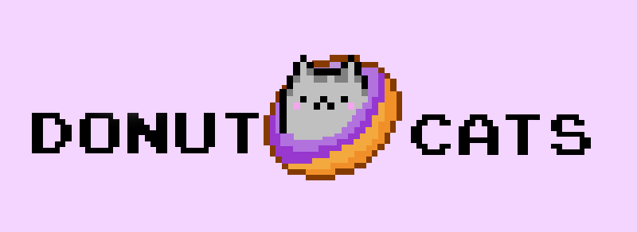

<h1 align="center"> Welcome to Donut Cats!</h1>

A game about a cat who loves to eat donuts.

Game made with Phaser 3, backgrounds & sprites drawn in Adobe Photoshop

# Running Locally:

1. Fork
2. clone and npm install
3. npm run start-dev

# Playing the Game:

- Wake your cat up! (hint: click it til it can't "stand" it)
- Use the cursor keys to move around the screen and collect donuts
- Purple Donuts increase your score and spawn more donuts
- Green Donuts Heal Your Damage
- Red Donuts Deal Damage
- When your bar is low enough you will absorb red donuts. You can
  use this to your advantage to clear the screen to generate more point donuts. Make sure to eat green donuts after to heal!
- Play again and try to beat your high score!

# Controls:

- Click to wake up (hint: click it til it can't "stand" it)
- Left cursor to walk left
- Right cursor to walk right
